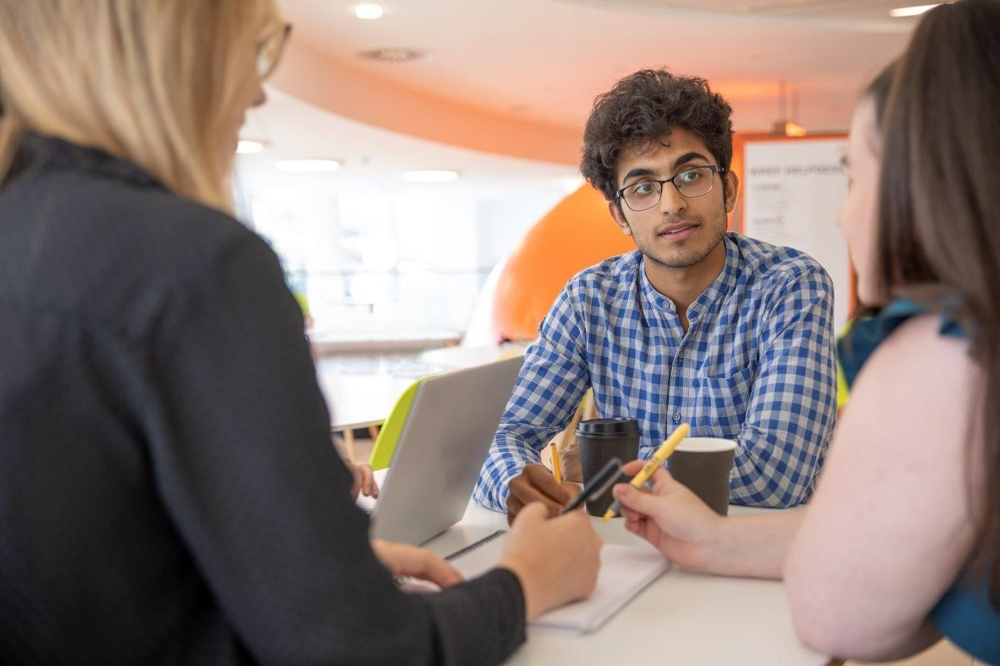

## Professional Summary
Experienced AI/ML engineer with a strong passion for mathematical modeling and computational techniques. Proficient in analyzing complex data and converting requirements into effective solutions that drive advancements and enhance human interactions. Eager to collaborate on innovative solutions that push the boundaries of AI, machine learning, and software engineering.
## About me

I am an **AI/ML Engineer II** at [GSK.ai](https://www.gsk.ai), where I work in the Target Discovery team to build and deploy machine learning models to discover transformational medicines. My research involves applications of machine learning for improving in-vivo success of protein-ligand binding through in-silico methods. I’ve also led the development of scalable **ETL pipelines** for Terabyte (TB) scale datasets, and achieved improved joint embeddings through on multi-view datasets through the use of **self-supervised contrastive learning** techniques. 

*Working with biological data is very humbling, as every data-related assumption is challenged by the inconsistencies created by intrinsic noise within biological systems. It has been a steep learning curve, and I have thoroughly enjoyed every part of it.*

I received a scholarship from [The Vicky Noon Foundation](https://www.noon-foundation.org) to study an integrated Masters in Information Engineering and Machine Learning from the University of Cambridge where I graduated with a starred distinction, **ranking 10th** out of a cohort of 370. While at university, I’ve had a broad range of experiences, from working at [BAE systems](https://www.baesystems.com/en/home) on their helmet mounted displays, to working in Nobel Laureate Sir John Gurdon’s lab on deriving features from images of perturbed frog cells. 

I like to collaborate on **machine learning and software engineering** projects with colleagues, friends and strangers alike, so feel free to reach out!

In my spare time, I like to run, lift weights and cook food. I’m currently training to get a qualification (Good for age) time for the Boston Marathon and learning to perfect a Mushroom Wellington. 

