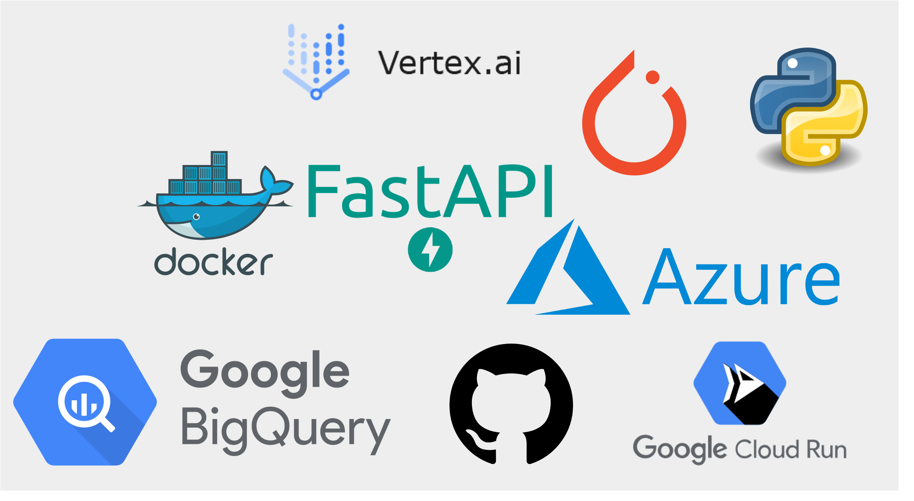

<!--more-->

#### :sparkles: What keeps me motivated:

I see an inspiring future unfolding in front of me—one where the fusion of AI/ML and science drives the development of revolutionary medicines leveraging genetics, organic chemistry, mathematical physiology and advanced machine learning techniques. Breakthroughs like Large Language Models (LLMs) have revolutionized natural language processing, while exponential increases in compute power have enabled us to tackle complex problems at scale. This convergence of technological progress offers unprecedented opportunities to revolutionize healthcare, making now a crucial juncture in the history of AI. As someone working at the intersection of AIML and software engineering, I am excited to be a part of this important moment. Being able to contribute to such groundbreaking advancements fills me with anticipation for the future where we pioneer innovation and make a profound impact on global healthcare.

#### 🎯 Key Achievements:

- **Contributions to Multiomics Research**: Published research in multiomics data integration, contributing to cutting-edge advancements in the field, and enhancing understanding of complex biological interactions.

- **Scalable ETL Pipeline Implementation**: Engineered scalable ETL pipelines for genomic datasets at the terabyte (TB) scale, leveraging Dask to enable efficient handling of large-scale data processing tasks.

- **Image-Omics Contrastive Learning Methods**: Worked on innovative image-omics contrastive learning methods by adapting [OpenAI's CLIP](https://openai.com/research/clip) in order to improve the signal-to-noise ratio from joint embeddings of image and transcriptomics datasets. 

#### 💡 Technical Leadership:

- **ML Architecture Design**: Drove the design and implementation of production-grade machine learning systems using PyTorch and Google Cloud Platform
- **Research Impact**: Published peer-reviewed research in multi-omics data integration, contributing to GSK's position as an industry leader in AI-driven drug discovery

#### 🤝 Strategic Collaborations:

- **Internal Leadership**: Supervised a University of Cambridge Maths graduate as a junior engineer, developing novel unsupervised methods for quality assesment of biological screening data.
- **Academic Partnership**: Established and managed research collaboration with Carragher Lab, Edinburgh, resulting in 2 joint publications in multi-view machine learning
- **Cross-functional Impact**: Bridged the gap between ML research and production deployment, working closely with biologists, chemists, and software engineers

#### :exclamation: Note:

I'm unable to disclose proprietary information, but I welcome readers to reach out for further information on my projects and achievements.

*My tech stack as an AI/ML Engineer at GSK*

#### 🚀 Core Technologies:
- **ML/AI**: PyTorch, TensorFlow, Scikit-learn, CUDA
- **Cloud & Infrastructure**: Google Cloud Platform, Docker, Kubernetes
- **Data Engineering**: Dask, PostgreSQL, BigQuery, Google Cloud Storage
- **Languages**: Python, R, SQL, Shell Scripting

#### :microscope: My mental model for problem-solving - an example:

    <strong>Algorithm 1: Predicting RNA Tractability via Machine Learning</strong>
    <pre style="white-space: pre-wrap; margin: 0;">
Input: RNA sequence and structural data
Output: Predicted RNA openness scores

1. Define the problem: Identify bindable regions on RNA by understanding structural accessibility.
2. Conduct stakeholder discussions and exploratory analysis to refine problem scope.
3. Develop proof of concepts, such as overlapping structural motifs with flexible regions 
   and validating potential training datasets against the hypothesis that flexible regions 
   are more accessible.
4. Present research ideation to stakeholders for feedback and alignment.
5. Build and deploy a production-ready machine learning model using PyTorch and Vertex AI.
6. Continuously refine the approach with advancements in the field, leveraging both internal 
   research and academic collaborations.
7. Output predicted RNA openness scores for downstream applications.
    </pre>

 
