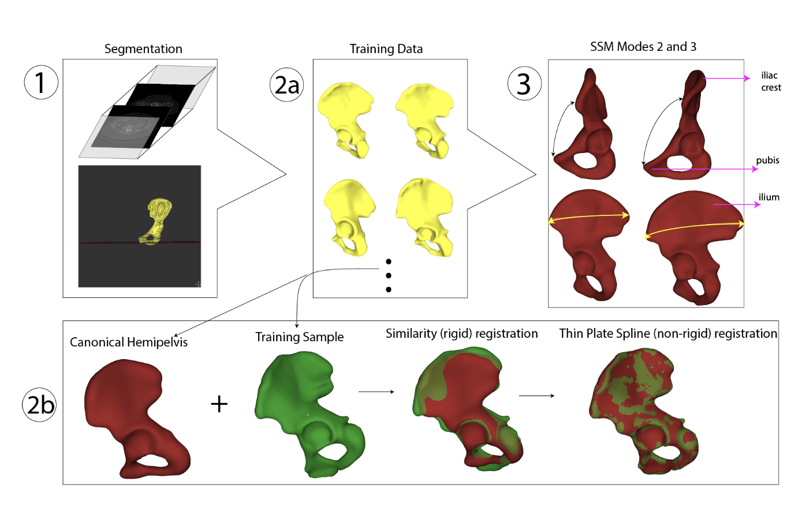

<!--more-->

# Link to Thesis
[Click here to read my thesis](../assets/pdfs/fyp.pdf?inline=true)

## Enhancing Joint Space Mapping Precision

In this project, I conducted an in-depth analysis of the sensitivity of Joint Space Mapping (JSM) to hip positioning and explored the criticality of maintaining consistent joint positioning for retrospective analyses of joint space maps.

I devised a semi-automated angulation protocol to quantify hip joint rotation using CT data, manipulating triangulated meshes of the pelvis and proximal femur. This protocol not only facilitated the extraction of anatomically plausible hip rotation measurements but also enabled a direct comparison with manual measurements by clinicians.

My investigation into the effect of hip rotation on JSM yielded compelling results. Contrary to expectations, I found no significant evidence indicating that changes in hip rotation affect the absolute Joint Space Width (JSW) difference between baseline and follow-up measurements. This conclusion was backed by a test-retest precision of approximately 0.3 mm.

Moreover, my research uncovered crucial sources of precision error within the JSM pipeline due to manual processing. This finding emphasized the need for automated segmentation protocols, inspiring my work on statistical approaches to image segmentation.

*Using statistical shape models to build canonical hip joint for semi-automated 3D modelling of patient hips.*

In summary, my findings demonstrated the resilience of JSM to changes in hip rotation, with any induced measurement noise deemed insignificant compared to other sources of error. These insights pave the way for further advancements in the field of musculoskeletal imaging and analysis.

## Project Highlights

1. **Statistical Shape Modelling for Automated 3D Hip Joint Reconstruction:**
   I leveraged statistical shape modeling techniques to construct canonical models of the hip joint. This breakthrough allowed for the automated 3D reconstruction of hip joints from CT images, streamlining the imaging process and significantly reducing manual processing.

2. **Development of an Angulation Protocol using C++:**
    I developed a sophisticated angulation protocol in C++ by deriving a coordinate system on the hip joint. This protocol not only enabled precise measurement of hip joint rotation but also facilitated seamless integration into existing imaging workflows.

3. **Extension of Stradview for Enhanced Imaging Analysis:**
   As a result of my research, I played a pivotal role in extending the capabilities of the closed-source package [Stradview](https://mi.eng.cam.ac.uk/Main/StradView), a widely used tool at the Cambridge University Machine Intelligence Lab. My contributions led to the integration of advanced functionalities tailored specifically for improved joint space mapping analysis within the Stradview environment.

4. **Utilization of Statistical Parametric Mapping for Spatial Data Analysis:**
   In addition to advancements in imaging techniques, I employed [statistical parametric mapping](https://www.fil.ion.ucl.ac.uk/spm/) to conduct rigorous statistical tests on spatial data. This approach allowed for comprehensive analysis of joint space maps, enabling robust inference and hypothesis testing.

---

## Publication References
My work builds on the work produced in this paper: 

Turmezei, T.D., Treece, G.M., Gee, A.H. et al. Quantitative 3D imaging parameters improve prediction of hip osteoarthritis outcome. Sci Rep 10, 4127 (2020). https://doi.org/10.1038/s41598-020-59977-2
