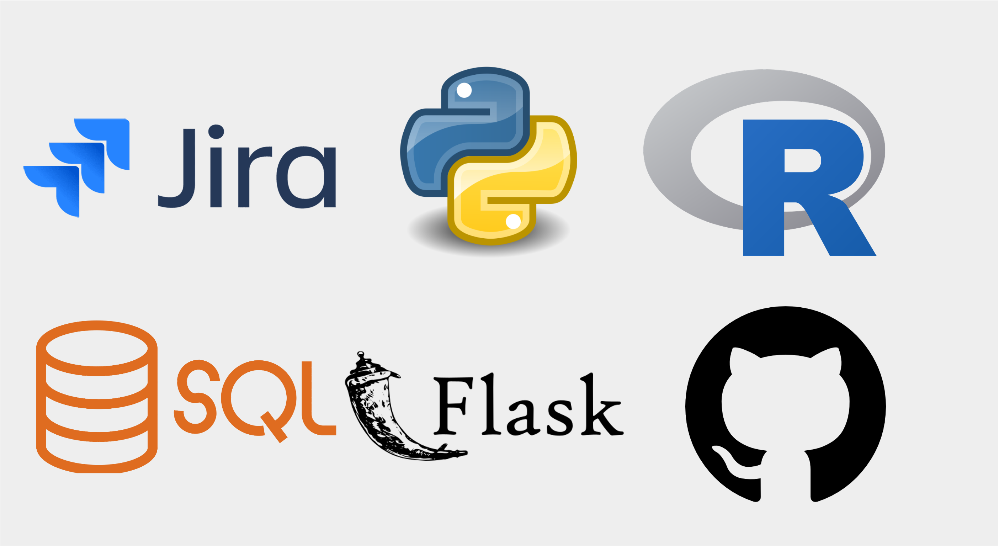

<!--more-->

## Role: Data Science and AI Associate

####  :clipboard: Overview
In my role as a Data Science and AI Associate within the Compound Screening for Drug Discovery team, I developed data models and pipelines for high-content profiling methodologies aimed at expediting the drug discovery process.

#### :trophy: Achievements
- Received a £1500 award for employee recognition for developing a new method of interfacing with on-prem servers using an **SSH client** and an easy to use front-end, allowing biologists to run image pipelines end-to-end and improving efficiency. 

#### :handshake: Collaborations:
- Carragher Lab, Edinburgh
- Broad Institute of MIT and Harvard

#### :bulb: Project Highlights
While most of the project details are proprietary, I summarise below some of the details of my work. Please feel free to reach out if you have further questions, or are interested in certain aspects of the work. 

{: .align-right width="50%"}

*Data Handling and Analysis*
- Leveraged data from DRUG-seq for miniaturized high-throughput transcriptome profiling in drug discovery.
- Developed and implemented robust **data normalization, visualization, and modeling** strategies.
- Utilized Bayesian methods, particularly the **Bayesian Group Factor Analysis** framework, to integrate data from various sources effectively.

*Automation and Scalability*
- Established **scalable data pipelines** to streamline project workflows.
- Automated metadata capture and integrated database inputs via **RESTful APIs**, reducing human errors and enhancing efficiency and accuracy.

:rocket: *Key capabilities developed*:
- UI/UX Design: I worked on designing user-friendly interfaces and experiences.
- Writing Production-Ready Code: I ensured that the code I wrote was ready for production use, following best practices for efficiency and maintainability.
- Agile Development: I worked within an **Agile** development framework, which allowed for iterative progress and flexibility.
- Data integrity and data quality good practices.

#### :globe_with_meridians: Outreach Initiatives

In addition to my project work, I was also actively involved in STEM outreach initiatives. I had the opportunity to introduce many under resourced sixth form students to the fields of AI, machine learning, and data science through the **leaders in STEM** program. By giving them an insight into the work I was doing, I aimed to inspire and engage these students, demonstrating the potential of these rapidly evolving fields.

 
