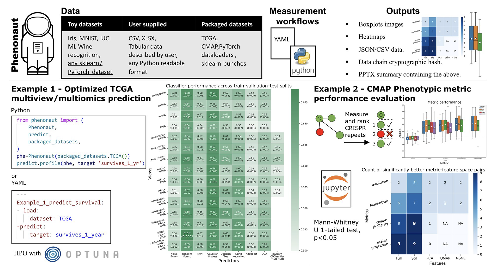

<!--more-->

## Data Integration Workflows for Multiomics Data

Data integration workflows for multiomics data take many forms across academia and industry. Efforts with limited resources often encountered in academia can easily fall short of data integration best practices for processing and combining high-content imaging, proteomics, metabolomics, and other omics data.

My team and I jointly developed **Phenonaut**, a Python software package designed to address the data workflow needs of migration, control, integration, and auditability in the application of literature and proprietary techniques for data source and structure agnostic workflow creation.

 

[Read Full Publication Here](https://academic.oup.com/bioinformatics/article/39/4/btad143/7082955?login=true){: .btn .btn--primary}

  
    

      <a href="{{ page.previous.url }}">← Previous Post</a>
    

  
  
    

      <a href="{{ page.next.url }}">Next Post →</a>
    

  

