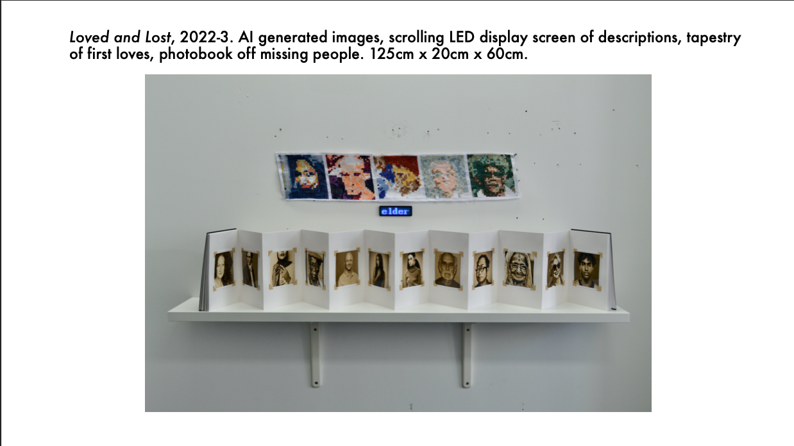
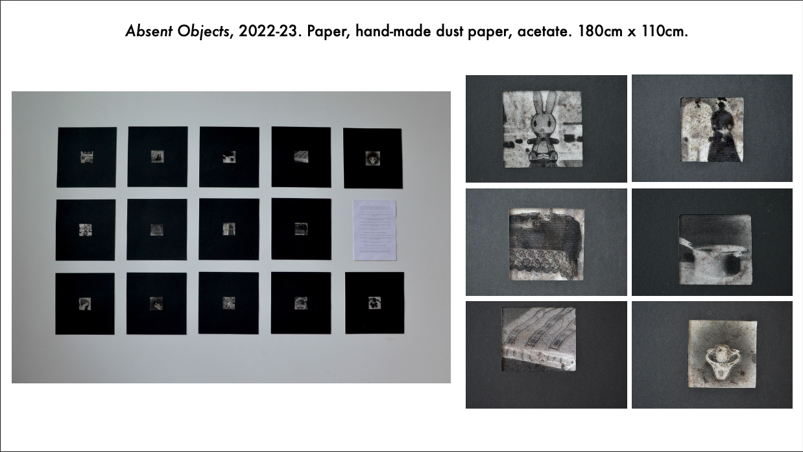
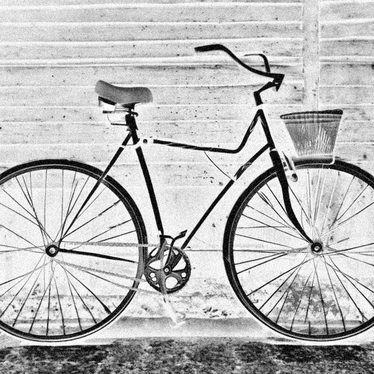
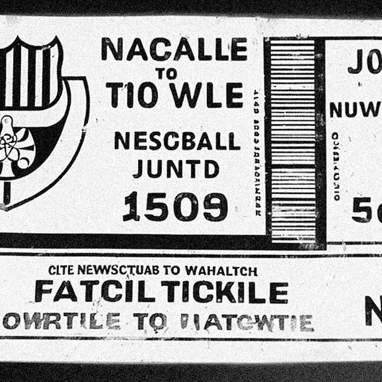
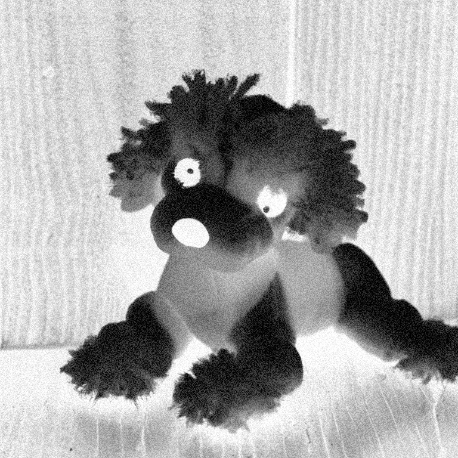
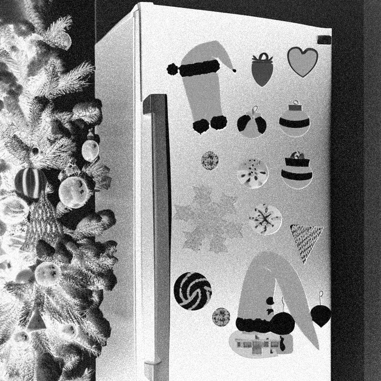

<!--more-->

# Welcome to My StyleCLIP Gallery

     

 

Welcome to my gallery featuring images generated using [CLIP and StyleGAN](https://github.com/abdullah-athar/StyleCLIP) from Hugging Face. In this unique exploration, I delve into the realm of false memories, questioning the authenticity of our recollections and the influence of external descriptions on our perception.

Each image showcased here is a product of the diffusion models that crafts visual representations based on textual input. What makes this project particularly intriguing is the fragmentary nature of the descriptions provided. These incomplete narratives serve as a canvas upon which technology weaves its interpretation, filling in the gaps and offering a glimpse into the ambiguous territory of memory.

     

 

As you navigate through these images, I invite you to ponder the blurred lines between personal recollection and external influence. Do these images align with your own memories, or do they blur the boundaries between reality and suggestion? It's a thought-provoking journey that challenges our understanding of perception and memory.

Join me as I unravel the complexities of human cognition and the transformative power of AI in shaping our visual landscapes. Explore, reflect, and delve into the intriguing world of false memories through the lens of CLIP+StyleGAN.

    
    
    
    
    

  
    

      <a href="{{ page.previous.url }}">← Previous Post</a>
    

  
  
    

      <a href="{{ page.next.url }}">Next Post →</a>
    

  

