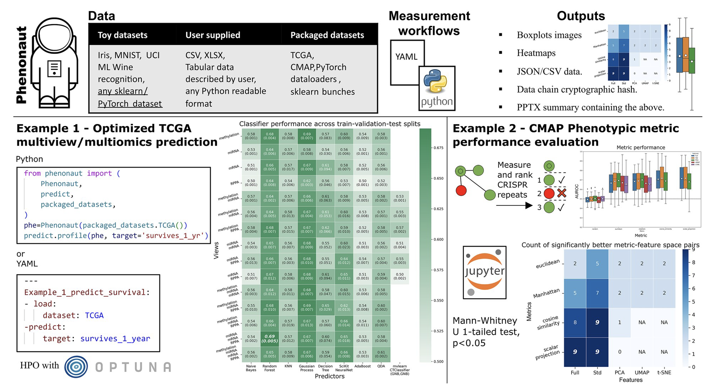

<!--more-->

  <a href="https://academic.oup.com/bioinformatics/article/39/4/btad143/7082955?login=true" class="btn btn--primary" style="padding: 0.8em 1.6em; font-size: 1.1em; text-decoration: none; border-radius: 6px; background-color: #2c3e50; color: white; transition: all 0.3s ease; box-shadow: 0 2px 5px rgba(0,0,0,0.1); &:hover { background-color: #34495e; transform: translateY(-2px); box-shadow: 0 4px 8px rgba(0,0,0,0.2); }">Read Paper</a>

#### :dart: Project Overview
Phenonaut is a Python software package that revolutionizes multiomics data integration by providing a robust framework for processing and analyzing high-content imaging, proteomics, metabolomics, and other omics data. Our solution addresses critical challenges in data workflow management, including:

- Migration and version control of large datasets
- Quality control and preprocessing pipelines
- Integration of heterogeneous data types
- Auditability and reproducibility of analyses

#### :gear: Technical Implementation

*Phenonaut's workflow visualization showing data integration and analysis pipeline*

#### :rocket: Key Features

1. **Data Source Agnostic Integration**
   - Support for multiple file formats (CSV, HDF5, parquet)
   - Custom data source adapters
   - Automated schema validation

2. **Workflow Management**
   - Pipeline versioning
   - Checkpoint saving
   - Parallel processing support
   - Error handling and recovery

3. **Analysis Capabilities**
   - Dimensionality reduction (PCA, t-SNE, UMAP)
   - Statistical testing frameworks
   - Visualization tools
   - Custom analysis plugins

4. **Quality Control**
   - Automated outlier detection
   - Missing value handling
   - Batch effect correction
   - Data normalization

#### :microscope: Case Studies

1. **High-Content Imaging Integration**
   - Processing of 100,000+ cellular images
   - Feature extraction using deep learning
   - Integration with proteomics data

2. **Multi-omics Data Analysis**
   - Integration of proteomics and metabolomics
   - Pathway enrichment analysis
   - Network analysis
   - Results: Identified novel pathway interactions

#### :books: Documentation & Resources

- [Full Documentation](https://phenonaut.readthedocs.io)
- [GitHub Repository](https://github.com/phenonaut)
- [API Reference](https://phenonaut.readthedocs.io/api)

  <a href="https://academic.oup.com/bioinformatics/article/39/4/btad143/7082955?login=true" class="btn btn--primary" style="padding: 0.8em 1.6em; font-size: 1.1em; text-decoration: none; border-radius: 6px; background-color: #2c3e50; color: white; transition: all 0.3s ease; box-shadow: 0 2px 5px rgba(0,0,0,0.1); &:hover { background-color: #34495e; transform: translateY(-2px); box-shadow: 0 4px 8px rgba(0,0,0,0.2); }">Read Paper</a>

 
