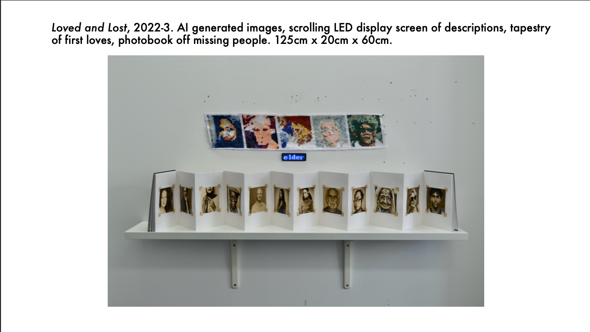
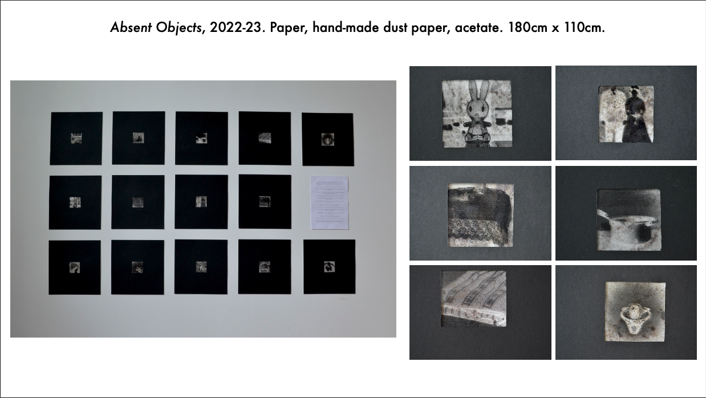
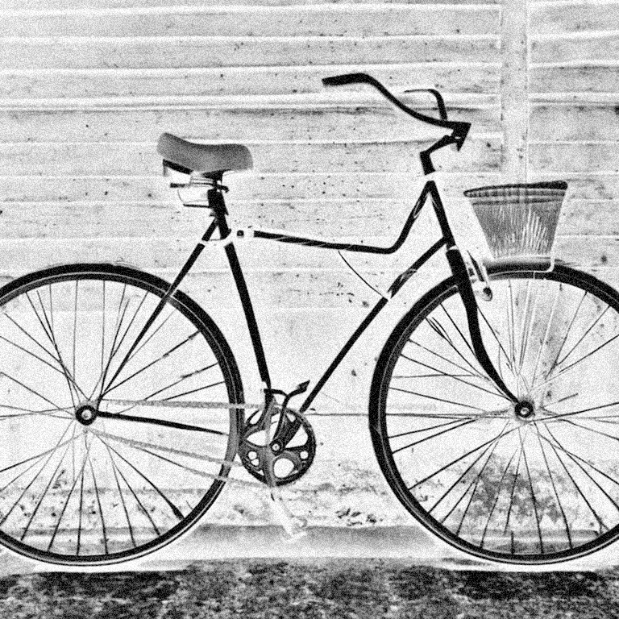
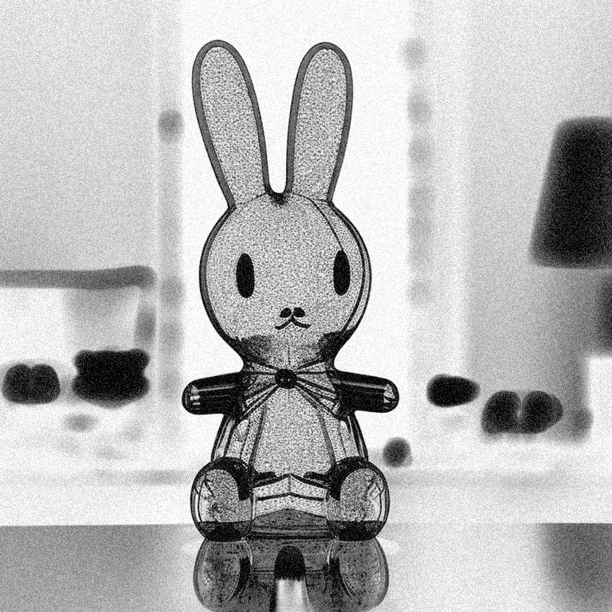
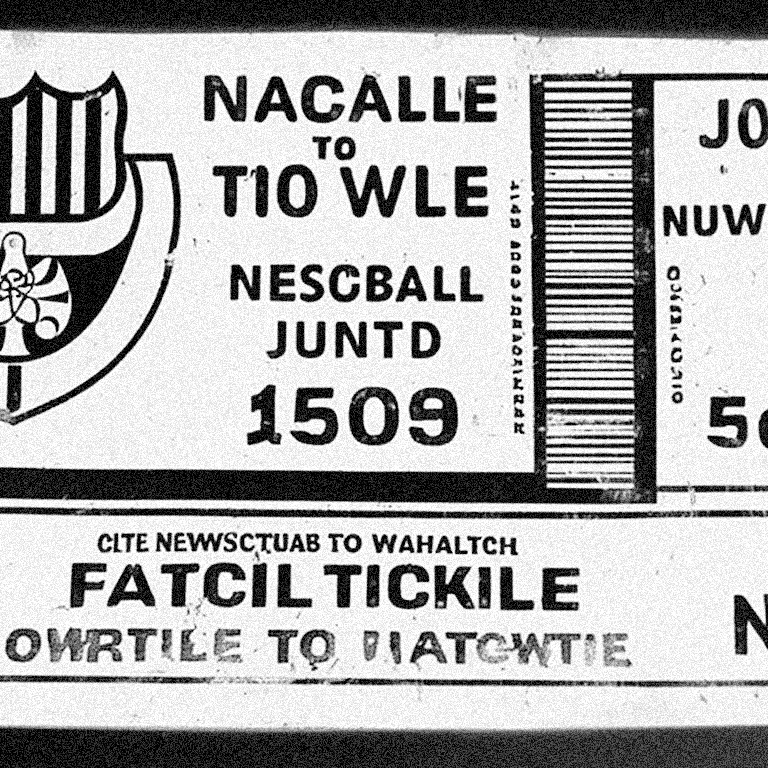
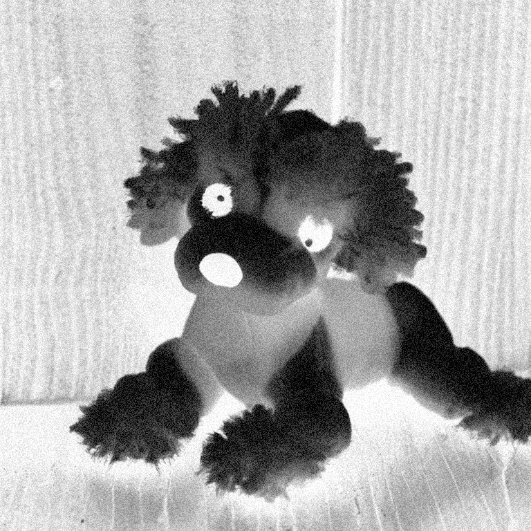
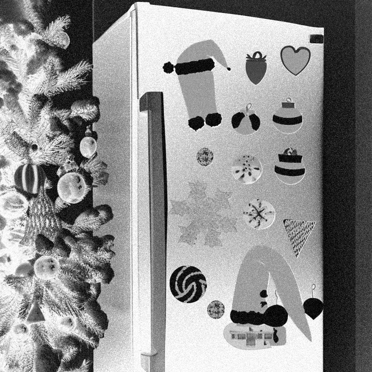

<!--more-->

# Welcome to My StyleCLIP Gallery

     

 

Welcome to my gallery featuring images generated using [CLIP and StyleGAN](https://github.com/abdullah-athar/StyleCLIP) from Hugging Face. In this unique exploration, I delve into the realm of false memories, questioning the authenticity of our recollections and the influence of external descriptions on our perception.

Each image showcased here is a product of the diffusion models that crafts visual representations based on textual input. What makes this project particularly intriguing is the fragmentary nature of the descriptions provided. These incomplete narratives serve as a canvas upon which technology weaves its interpretation, filling in the gaps and offering a glimpse into the ambiguous territory of memory.

     

 

As you look at these images, consider how your memories might be influenced by external factors. Do these pictures match your recollections, or do they blur the line between what's real and what's suggested? It's a journey that makes you think about how we perceive things and remember them.

Let's explore how AI can shape our visual experiences and challenge our understanding of memory. Dive into the fascinating world of false memories with CLIP+StyleGAN.

    
    
    
    
    

  
    

      <a href="{{ page.previous.url }}">← Previous Post</a>
    

  
  
    

      <a href="{{ page.next.url }}">Next Post →</a>
    

  

