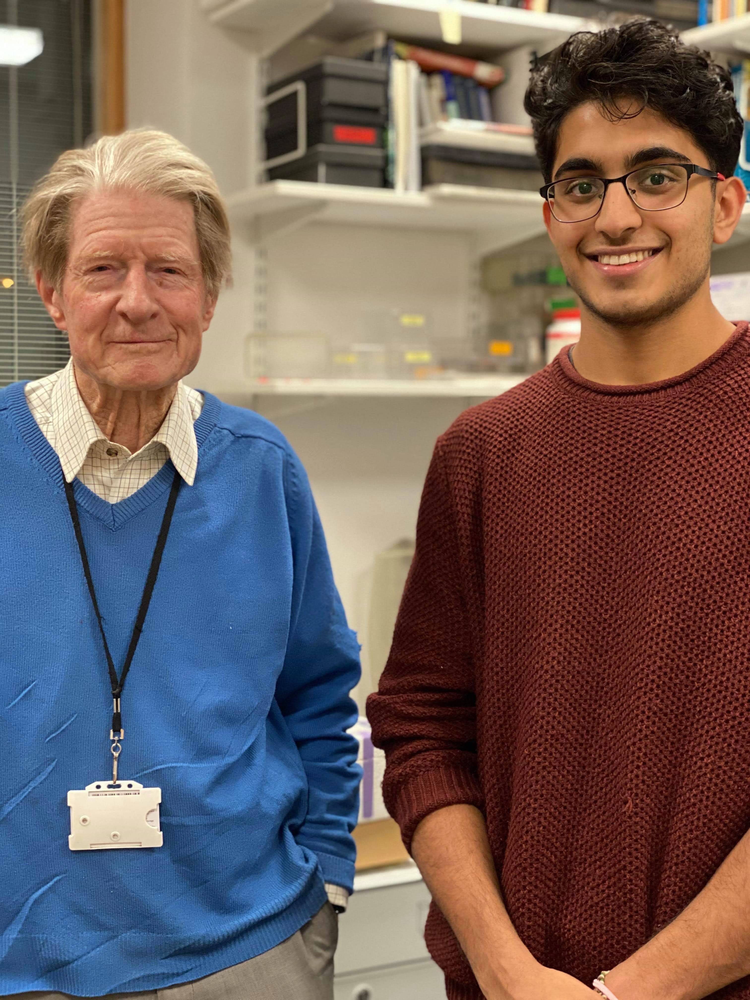

<!--more-->

## Research Assistant at Wellcome/CRUK Gurdon Institute
*Internship with Nobel Laureate John Gurdon*
- **Duration**: Dec 2019 - Mar 2020 (4 months)
- **Location**: Cambridge, England, United Kingdom

  

### Project Overview:
- Collaborated with Nobel laureate Sir John Gurdon on a project leveraging Convolutional Neural Networks (CNNs) to analyze microscopy images of treated frog cells.
- Utilized AI and machine learning techniques to extract phenotypic features from these images.
- Focused on developing algorithms for classifying perturbations, distinguishing diseased cells from healthy cells, and identifying other cellular abnormalities.

### Achievements:
- Spearheaded the development and implementation of CNN-based image analysis methodologies.
- Contributed to advancing the understanding of cellular dynamics and pathology through innovative AI-driven approaches.
- Played a pivotal role in the interdisciplinary research efforts at the forefront of molecular biology and artificial intelligence.

### Key Skills Utilized:
- **AI/ML**: Applied CNNs for image analysis and classification tasks. Developed algorithms to extract meaningful features from microscopy images.
- **Data Analysis**: Analyzed experimental data to derive actionable insights.
- **Collaboration**: Worked closely with renowned researchers to achieve project objectives.
- **Problem Solving**: Identified and addressed challenges in image analysis and classification.

  
    

      <a href="{{ page.previous.url }}">← Previous Post</a>
    

  
  
    

      <a href="{{ page.next.url }}">Next Post →</a>
    

  

